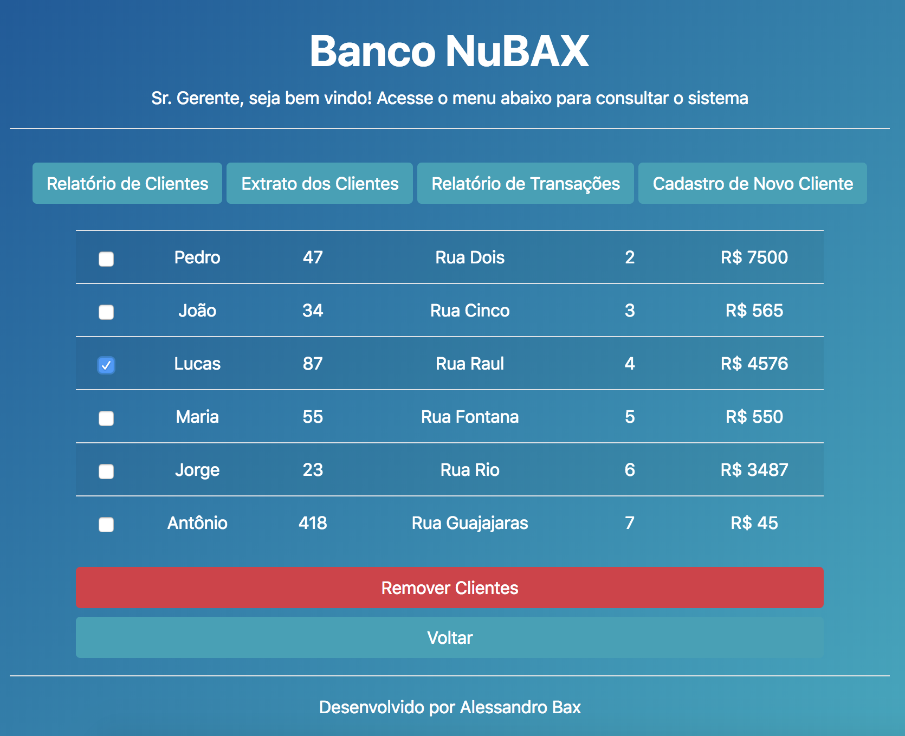

# NuBax
(Projeto em desenvolvimento)
Projeto de um app de banco, realizado como exercício inicial de GBS na IBM.



## Getting Started

O projeto foi construido com a arquitetura MEAN Stack (Mongo, Express, AngularJS e Node.js)


### Installing

Para rodar o projeto siga os passos a seguir:

Clonando o repositório

```
git clone https://github.com/alessandrobax/nubax.git
```

Instalando as bibliotecas

```
npm install
```

Rodando o projeto

```
node server
```

O projeto roda em localhost:3000


## Authors

Alessandro Bax


